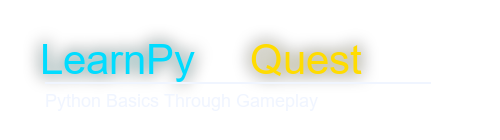

<!-- ===================================================== -->
<!--                  LEARNPY QUEST V2 README              -->
<!-- ===================================================== -->

<h1 align="center">
  
</h1>

<h1 align="center">🚀 LearnPy Quest V2</h1>

<p align="center">
  <b>Learn Python Basics Through Gameplay</b><br>
  An interactive educational <b>Pygame</b> adventure where players solve Python quizzes, collect keys, unlock doors, and progress through maze-based levels.
</p>

<p align="center">
  
  
  
  
</p>

<p align="center">
  
</p>

---

## 🎮 Project Overview

**LearnPy Quest V2** is a polished educational game developed using **Python** and **Pygame**.  
Instead of learning Python through boring static quizzes, players explore maze-like levels, collect keys, unlock doors, and answer Python concept-based challenges to progress.

This project is designed to make **basic Python concepts fun, visual, and interactive**.

### 🧠 Python Concepts Covered:
- Variables
- Data Types
- Operators
- If-Else
- Loops
- Lists
- Functions
- Booleans

---
🏆 Why This Project Stands Out

Unlike basic beginner projects such as:

Snake Game

Tic-Tac-Toe

Rock Paper Scissors

Simple Quiz Apps

LearnPy Quest V2 combines:

🎮 Game development

📚 Educational logic

🧠 Python concept reinforcement

🖼️ Custom assets

🎵 Sound integration

💼 Portfolio-ready presentation

This makes it a unique beginner-to-intermediate Python project.
---

## ✨ Key Features

- 🎯 **Interactive Python Learning**
- 🧩 **Maze-Based Gameplay**
- 🔐 **Key Collection + Door Unlock Mechanic**
- ❓ **Multiple Quiz Questions Per Level**
- 🖱️ **Clickable UI Buttons**
- 🎵 **Custom Generated Sound Effects**
- 🖼️ **Auto-Generated Cyber-Themed Assets**
- ❤️ **Lives System**
- 🏆 **Win / Lose States**
- 📈 **Score Tracking**
- 🎮 **Keyboard + Mouse Support**
- 🌌 **Futuristic Neon UI Theme**

---

| Action             | Keys                   |
| ------------------ | ---------------------- |
| Move Up            | `W` / `↑`              |
| Move Down          | `S` / `↓`              |
| Move Left          | `A` / `←`              |
| Move Right         | `D` / `→`              |
| Select Quiz Option | `1 / 2 / 3 / 4`        |
| Submit Answer      | `Enter`                |
| Start Game         | `Enter` or Mouse Click |
| Restart            | `R`                    |
| Quit               | `Esc`                  |


---

👨‍💻 Author

Shiv

Python Developer | AI Projects | Game + UI Based Learning Projects

<p align="center">  </p> ```
